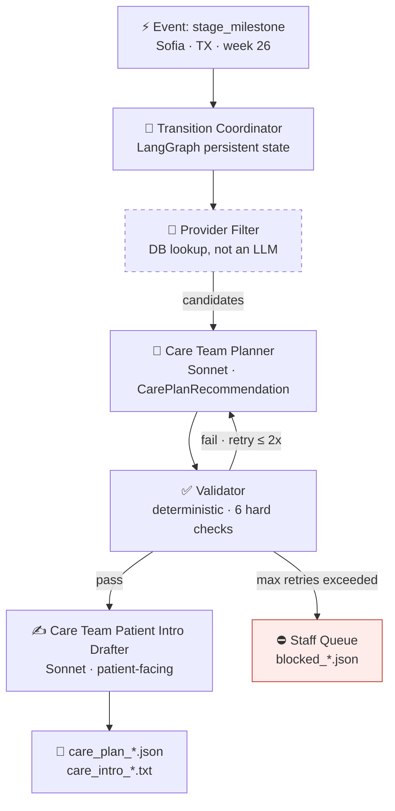
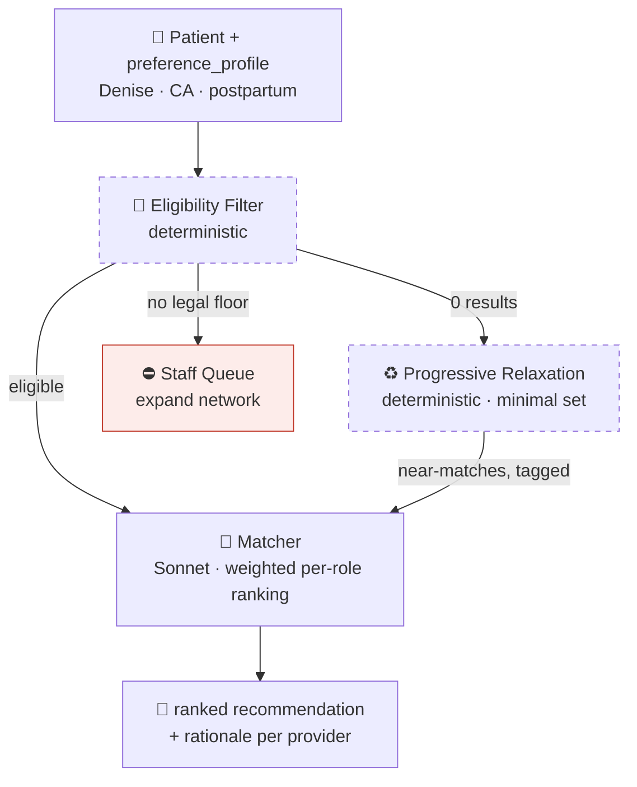

# AI Agents for Telehealth: Proactive Women's Health Care

> **This is not a real company.** Astralace Women's Health is a fictional telehealth platform.
> All patient data, provider data, and clinical scenarios are entirely synthetic.
> Nothing in this repo constitutes medical advice.

---

## What if AI agents made women's health care proactive instead of reactive?

This demo focuses on the pregnancy and postpartum journey as the first user journey: a high-stakes, time-sensitive arc where the difference between proactive and reactive care is most concrete.

Most telehealth platforms wait for patients to show up with a problem. This project explores a different model: what if an AI system anticipated the next stage of a patient's journey and built her care team *before* she needed it?

The lactation consultant is introduced at week 34, before birth, not after a struggling new mother calls in a panic. The pelvic floor PT starts at week 20, before symptoms appear. The career coach enters at week 10, while there's still time to design a thoughtful maternity leave plan with her manager.

This repo is a portfolio demo that uses a fictional Maven-style women's telehealth clinic to showcase:

- **Proactive care coordination**: event-driven agents that plan ahead, not triage after
- **Preference-weighted matching**: per-patient weighted provider ranking over a deterministic eligibility floor
- **Multi-agent system design**: LangGraph orchestration, structured outputs, validator-as-safety-critic
- **Product thinking**: care pathway design, clinical workflow constraints, data modeling

---

## The Care Coordination Agent [`agents/care_coordination_agent.py`]

Event-driven care team planning for maternity and postpartum journeys. The Transition Coordinator (TC) wakes on stage milestone events and orchestrates a four-node pipeline.



**Demo scenario:** Sofia Nguyen, TX, 26 weeks pregnant, second trimester. The TC detects she's approaching her third trimester and builds her T3 care team.

```bash
python agents/care_coordination_agent.py --patient pat_002
```

**Design decisions worth noting:**

*Provider Filter is not an LLM.* State licensure checks and availability filters are deterministic. Running them as a DB-style function before the Planner reduces token cost, removes hallucination surface area, and keeps the model focused on reasoning, not lookups.

*Validator is code, not a model.* Every check is a factual yes/no from a data field (licensed in-state? panel open? ID real?). Facts don't need judgment, and code gets them right every time.

*Validator blocks, not retries forever.* After 2 failed attempts, the plan routes to a staff queue rather than degrading silently. In a system touching patient care decisions, "probably correct" isn't acceptable.

**Validator hard checks:**

| Check | What it catches |
|-------|----------------|
| `state_license_valid` | Provider not licensed in patient's state |
| `accepting_new_patients` | Closed panel slipped through filter |
| `no_hallucinated_ids` | Planner invented a provider not in candidate list |
| `continuity_preserved` | Required continuity provider dropped without explanation |
| `unmet_needs_flagged` | Required provider type silently missing from plan |
| `language_preference_met` | Patient language need unmet |

---

## The Care Matching Agent [`agents/care_matching_agent.py`]

Ranks the clinic's eligible providers for a patient by that patient's *weighted* preferences, producing a recommendation plus rationale for a human coordinator. The weights come from the individual patient's own signals (explicit intake asks weigh highest; inferred behavioral signals weigh weakly and never override an explicit one), never from demographic assumptions.



**Two-layer eligibility:**

- **Legal floor, never relaxed:** state license and `accepting_new_patients`. Zero results here is an *escalation* (expand network / staff queue), not a relaxation. Relaxing a license would recommend a provider who cannot legally treat the patient.
- **Firm constraints, relaxable:** language, scheduling daypart, gender, modality. When no provider satisfies all of them, the filter drops the **minimum** set (smallest, least-costly) needed to surface near-matches, and tags exactly what it relaxed. It never silently widens a constraint.

```bash
# Rank the full care team for a patient's current stage
python agents/care_matching_agent.py --patient pat_003

# Focus one role
python agents/care_matching_agent.py --patient pat_003 --role therapist

# Deterministic filter + relaxation only, no API key needed
python agents/care_matching_agent.py --patient pat_021 --role pelvic_floor_pt --no-llm
```

**Design decisions worth noting:**

*The eligibility floor is code, the ranking is the model.* The legal floor and relaxation are pure functions: factual, safety-critical, and unit-tested without an API key (`agents/test_matching.py`). The single LLM call is the weighted ranking, the one genuinely probabilistic step.

*Relaxation is minimal, not greedy.* It finds the smallest set of firm constraints to drop, breaking ties by lowest cost, so a patient whose only blocker is a rare language doesn't also lose their scheduling preference.

*The preference profile is stored state, not re-extracted.* A real profile is accumulated and refined over time. The matcher reads it; an LLM refinement step (a new signal re-weighting the profile) is documented in the architecture as the next beat, not run in v1.

---

## Care Pathway Design

The standard maternity pathway spans four stages. Each intervention has an `evidence_level` (`established` or `emerging`): the pathway combines clinical standards with proactive interventions designed to prevent problems rather than respond to them.

| Stage | Weeks | Proactive care team |
|-------|-------|---------------------|
| T1 | 1-12 | OB-GYN · Dietitian · Therapist · Career Coach *(leave planning)* |
| T2 | 13-27 | OB-GYN · Pelvic Floor PT · Dietitian *(GD screening)* · Career Coach *(handoff)* |
| T3 | 28-40 | OB-GYN · Pelvic Floor PT · Lactation Consultant · Pediatrician · Career Coach *(RTW plan)* |
| Postpartum | 0-12pp | OB-GYN · LC · Pelvic Floor PT · Therapist · Career Coach *(re-entry)* |

The data layer also includes schema stubs for future pathway variants (Gestational Diabetes, Mental Health Risk, High-Risk OB), each triggered by `clinician_flagged_need`, never auto-activated by the agent.

---

## Mock Data

All data is synthetic. Located in `mock-data/`:

| File | Contents |
|------|----------|
| `generate.py` | Seeded, reproducible generator. The single source of truth for `providers.json` and `patients.json`; same `--seed` yields the same dataset. |
| `providers.json` | 80 synthetic providers across perinatal specialties: OB-GYN, therapist, lactation consultant (LC), pelvic floor PT, dietitian, midwife, psychiatrist, pediatrician, coaches. Each has `gender`, `licensed_states`, languages, `availability_dayparts`, and insurance. |
| `patients.json` | 300 synthetic patients across the maternity journey (prenatal through postpartum), with `care_stage`, `pregnancy_week`, and a weighted `preference_profile`. Three curated anchors + scenario fixtures + seeded bulk. |
| `care-pathways.json` | Standard maternity pathway (4 stages, 20+ interventions) + future variant schemas. |
| `schedules.json` | Provider availability and booked slots. |
| `clinic.json` | Clinic metadata: hubs, product areas, policies. |

---

## Architecture

[`ARCHITECTURE.html`](ARCHITECTURE.html): full flow diagrams, data access boundaries table, and validator pattern. Open in a browser; diagrams are rendered with Mermaid.js.

---

## Tech Stack

| | |
|--|--|
| **Orchestration** | LangGraph: StateGraph, conditional routing, persistent TC state |
| **Models** | `claude-sonnet-4-6` (planner / drafter). Validator is deterministic code, no model. |
| **Structured outputs** | Pydantic: `CarePlanRecommendation`, `RecommendedProvider`, `ValidationResult` |
| **LLM client** | langchain-anthropic: `.with_structured_output()` for typed model responses |
| **Runtime** | Python 3.11+ |

---

## Setup

```bash
# Install dependencies
pip install -r agents/requirements.txt

# Add your Anthropic API key
cp .env.example .env
# edit .env → ANTHROPIC_API_KEY=sk-...

# Run the care coordination agent (demo: Sofia, TX, 26 weeks)
python agents/care_coordination_agent.py --patient pat_002
```

**Model selection (optional).** The models are configurable via environment
variables, so you can run the demo on whatever you have access to:

| Variable | Default | Role |
|----------|---------|------|
| `PLANNER_MODEL` | `claude-sonnet-4-6` | Care Team Planner |
| `DRAFTER_MODEL` | `claude-sonnet-4-6` | Patient Intro Drafter |

Set them in `.env` or your shell to override.

---

## Project Structure

```
├── agents/
│   ├── care_coordination_agent.py   # Care coordination + Transition Coordinator
│   ├── care_matching_agent.py       # Preference-weighted provider matching
│   ├── clinic_data.py               # Shared data loaders + provider-type mapping
│   ├── test_matching.py             # Keyless tests for the eligibility filter
│   └── output/                      # Care plans + patient intros per run
├── mock-data/
│   ├── generate.py                  # Seeded synthetic data generator (source of truth)
│   ├── providers.json               # 80 providers with licensed_states, gender, dayparts
│   ├── patients.json                # 300 patients with care_stage + preference_profile
│   ├── care-pathways.json           # Standard maternity pathway + variant schemas
│   ├── schedules.json
│   └── clinic.json
└── ARCHITECTURE.html                # Rendered architecture diagrams (open in browser)
```
